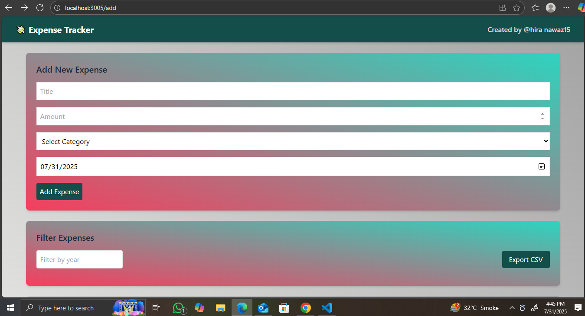

#  Expense Tracker App

A simple and stylish expense tracker built with **React**, **Tailwind CSS**, and **LocalStorage** for managing and visualizing personal expenses.

## Features

-  Add new expenses (title, amount, date)
-  View all expenses in a list format
-  Filter expenses by year
-  Visual chart display (bar graph)
-  Data stored in browser's **LocalStorage**
-  Clean and responsive UI with Tailwind CSS
-  Persistent data across sessions

## 📸 Screenshots

| Home Page | Expense Chart |
|-----------|----------------|
|  |  |


---

##  Tech Stack

- React (Functional Components + Hooks)
- Tailwind CSS
- JavaScript (ES6+)
- LocalStorage API
- React Router

---

## Installation

```bash
# Clone the repository
git clone https://github.com/yourusername/expense-tracker.git
cd expense-tracker

# Install dependencies
npm install

# Start the development server
npm start
